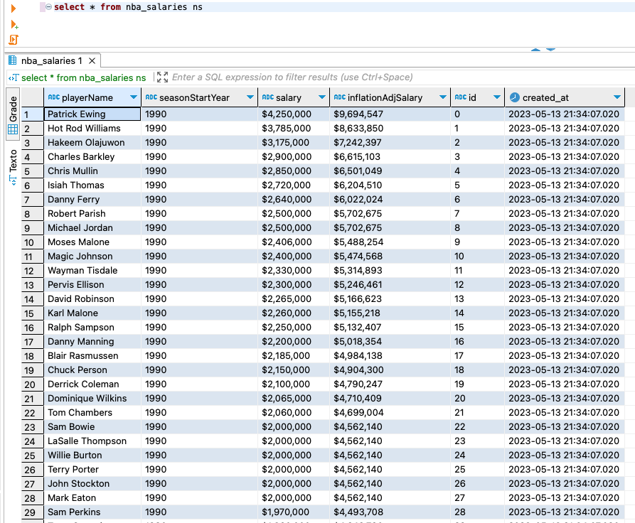

# how-bootcamp-eng-dados
Repositório com material do bootcamp de engenharia de dados da How

## Desafio 1

Para a resolução do desafio foi criado criado um Notebook no Google Colab. Basta iniciar uma nova sessão no Google Colab, fazer o upload do Notebooke e seguir as orientações nele contidas.

### Algumas imagens das tabelas

Top Tech Startups

NBA Payroll

NBA Player Box Score Stats

NBA Player Stats

NBA Salaries
